<h1 align="center">Hey  I'm Eyuel Atskemariam</h1>
<h3 align="center">Backend  Developer</h3>

  

## 📌 About Me
- 🌱 Currently learning Backend Engineering and Distributed System
- 🚀 Building backend applications with Go, APIs, databases, and system design principles
- 🤝 Open to collaborating on backend, infrastructure, and open-source projects
- 💡 Interested in scalable systems, software architecture, and performance optimization
- 📚 Continuously improving my problem-solving and engineering skills
- ⚡ Building from Ethiopia 🇪🇹

## 🧠 My Focus Areas
- ⚙️ Backend Engineering
- 🐹 Go (Golang)
- 🗄️ Database Design & Optimization
- 🌐 REST APIs & Web Services
- ☁️ Cloud & DevOps
- 🏗️ Software Architecture
- 🔧 Developer Tools & Automation
- 📊 Distributed Systems

## 📊 GitHub Stats & Trophies

  

  

  

## 🛠️ Languages & Tools

<h3 align="center">Programming Languages</h3>

  &nbsp;
  &nbsp;
  &nbsp;
  &nbsp;
  

<h3 align="center">Frontend</h3>

  &nbsp;
  

<h3 align="center">Database</h3>

  &nbsp;
  &nbsp;
  

<h3 align="center">DevOps & Cloud</h3>

  

<h3 align="center">Tools</h3>

  &nbsp;
  

  

## 🔗 Connect with Me

  &nbsp;
  

<picture>
  <source media="(prefers-color-scheme: dark)" srcset="https://raw.githubusercontent.com/tobiasmeyhoefer/tobiasmeyhoefer/output/github-snake-dark.svg" />
  <source media="(prefers-color-scheme: light)" srcset="https://raw.githubusercontent.com/tobiasmeyhoefer/tobiasmeyhoefer/output/github-snake.svg" />
  
</picture>

